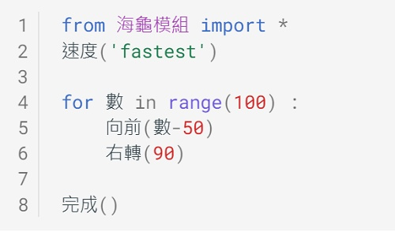
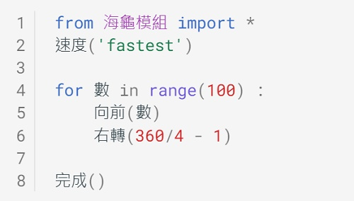

---
hide:
  - navigation
---

# 📚海龜畫禪繞

: 禪繞畫是由美國的芮克（Rick Roberts）與瑪莉亞（Maria Thomas）這對夫妻於2005年創辦。畫法是以簡單的圖樣規則一筆一筆畫出。在禪繞畫的作畫過程中，可以讓人保持、放鬆、專注與平靜，是一種人人都可從事的繪畫活動。

: 

: (資料來源:[^zentangle_example])

[^zentangle_example]: Zentangle art || Doodle patterns || Zen-doodle,Bycharvi ashtekar, [youtube連結](https://youtu.be/gBsW_wpFBxc) 

: 雖然禪繞畫大多是以紙與筆來完成(紙磚、代針筆、2B鉛筆等)，不過禪繞畫的特點之一是「沒有框架丶可自由創作」，所以在這個課程中，我們會跳脫框架，使用海龜程式來畫出禪繞圖，試試看當科技與藝術結合時，會產生怎樣的火花。

??? info "關於海龜程式"

    : Py4t海龜程式的介紹，加上中文的函式庫、範例程式與原始碼。

    : :fontawesome-solid-link: <a href="../../turtle4t/" target="_blank">海龜學習模組 說明</a>

    

----------------------------

##  📙 禪繞要素

----------------------------

: 禪繞畫看起來很美麗，但卻好像有點複雜，要如何畫出禪繞畫？它的基本要素是什麼？

: <iframe width="560" height="315" src="https://www.youtube.com/embed/tOSbo8fHPgQ?start=158&amp;end=521" frameborder="0" allow="accelerometer; autoplay; encrypted-media; gyroscope; picture-in-picture" allowfullscreen></iframe>

: (6分03秒, 資料來源:[^zentangle_first_time])

[^zentangle_first_time]: 學一次禪繞畫就上手!!新手必學四招！ft.芬妮心理師 Beginners Guide to Start Zentangles, By 棋樂玩文具 , [youtube連結](https://youtu.be/tOSbo8fHPgQ) 

 

: 禪繞畫是由多個圖樣組成，從影片中，我們可以看到幾種常見的圖樣。(也可以自己創造哦)

: 

: (資料來源:[^zentangle_first_time])

 

: 在作畫時也會使用到填滿及陰影的技巧，讓畫面更有層次感。

: 

: (資料來源:[^zentangle_first_time])

 

: 禪繞畫會依照圖樣的簡單規則來重複畫出。它的筆畫5元素簡稱icso，分別代表點、直線、弧線、S型、圓形。

: 

: (資料來源:[^rule_and_element])

[^rule_and_element]: 親子DIY創作 舒壓禪繞畫, By 明報 Mingpao, [youtube連結](https://youtu.be/oEvT826CHn8) 

: 經由以上的簡介，大家是不是比較了解禪繞畫了呢？

: 原來禪繞畫的基本要素有「**筆畫5元素**」、「**圖樣規則**」、「**重複畫出**」、「**填滿及陰影**」等。

: 接下來，要使用海龜程式畫出簡單的禪繞畫囉。

    

----------------------------

##  📗 迴轉線條(4) 

***方陣擴大*** 

----------------------------

: 

 

: 

 

: 

 

???+ example "範例程式 方陣擴大 - - - - - - - (迴轉線條1/4 新檔)"

    === "🎦操作影片"
    
        <iframe width="560" height="315" src="https://www.youtube.com/embed/jwwAbyi0Ang?start=2&amp;end=152" frameborder="0" allow="accelerometer; autoplay; encrypted-media; gyroscope; picture-in-picture" allowfullscreen></iframe>

        【長度2:30 章節時間如下】

        *0:00 存檔、匯入模組

        *0:50 方陣擴大

    === "💻程式截圖"

         

    

----------------------------

***長度迭代***

----------------------------

: 

 

: 

 

???+ example "範例程式 長度迭代 - - - - - - - (迴轉線條2/4 接續)"

    === "🎦操作影片"
    
        <iframe width="560" height="315" src="https://www.youtube.com/embed/jwwAbyi0Ang?start=155&amp;end=271" frameborder="0" allow="accelerometer; autoplay; encrypted-media; gyroscope; picture-in-picture" allowfullscreen></iframe>

        【長度1:56 章節時間如下】

        *2:35 長度迭代

    === "💻程式截圖"

         

    

----------------------------

***角度迭代***

----------------------------

: 

 

: 

 

???+ example "範例程式 角度迭代 - - - - - - - (迴轉線條3/4 接續)"

    === "🎦操作影片"
    
        <iframe width="560" height="315" src="https://www.youtube.com/embed/jwwAbyi0Ang?start=273&amp;end=394" frameborder="0" allow="accelerometer; autoplay; encrypted-media; gyroscope; picture-in-picture" allowfullscreen></iframe>

        【長度2:01 章節時間如下】

        *4:33 角度迭代

    === "💻程式截圖"

         

    

----------------------------

***玩轉禪繞***

----------------------------

: 

 

: 

 

???+ example "範例程式 玩轉禪繞 - - - - - - - (迴轉線條4/4 接續)"

    === "🎦操作影片"
    
        <iframe width="560" height="315" src="https://www.youtube.com/embed/jwwAbyi0Ang?start=398&amp;end=535" frameborder="0" allow="accelerometer; autoplay; encrypted-media; gyroscope; picture-in-picture" allowfullscreen></iframe>

        【長度2:17 章節時間如下】

        *6:38 玩轉禪繞

    === "💻程式截圖"

        

    

----------------------------

##  📘 花樣圓圈

----------------------------

建構中…

    

----------------------------

##  📙 點點螺旋 

----------------------------

建構中…

    

----------------------------

##  📗 色塊重疊 

----------------------------

建構中…

   