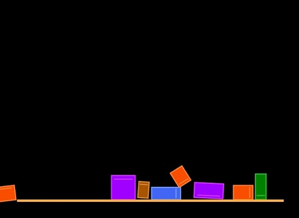

# 🔰 物理碰撞範例 - 無摩擦力
--------------
#### 🏷️ 說明

無摩擦力的世界，按滑鼠左鍵會新增方塊

<sup><sub>註：物理模組輔助功能，按住Ctrl及Alt鍵時，會顯示畫面座標，並可利用滑鼠右鍵新增、移除地形</sub></sup>

--------------

#### 📄 程式碼

```python
from 物理模組 import *

舞台 = 物理引擎(800,800)

def 按下滑鼠時(x, y):
    物體 = 新增方塊()
    物體.位置 = [x, y]
    物體.摩擦 = 0
    
模擬主迴圈()
```

--------------

#### 💻 執行截圖




