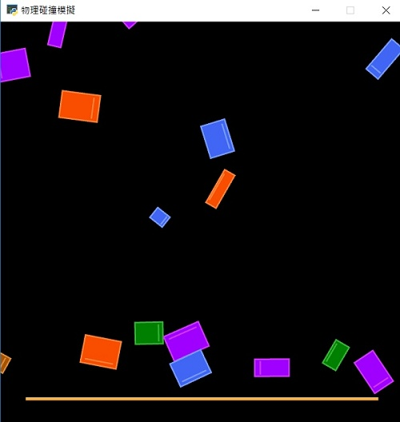

# 🔰 物理碰撞範例 - 操控重力
--------------
### 🏷️ 原理說明

操控重力 (滑鼠左鍵新增物體，用上下左右鍵操控重力)

--------------

### 📄 Py4t程式碼

```python
from 物理模組 import *
from random import randint

舞台 = 物理引擎(800,800)
舞台.重力 = [0, 0]

def 按下滑鼠時(x, y):
    物體 = 新增方塊()
    物體.位置 = [x, y]
    物體.速度 = [randint(-100,100), randint(-100,100)]
    物體.角速度 = randint(-100,100)
        
def 按下鍵盤時(按鍵, x, y):
    if 按鍵 == key.UP :
        舞台.重力 = [0, 800]
    if 按鍵 == key.DOWN :
        舞台.重力 = [0, -800]
    if 按鍵 == key.RIGHT :
        舞台.重力 = [800, 0]
    if 按鍵 == key.LEFT :
        舞台.重力 = [-800, 0]

def 放開鍵盤時(按鍵, x, y):
    舞台.重力 = [0, 0]
    
模擬主迴圈()
```

--------------

### 💻 執行截圖




