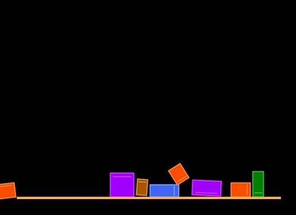
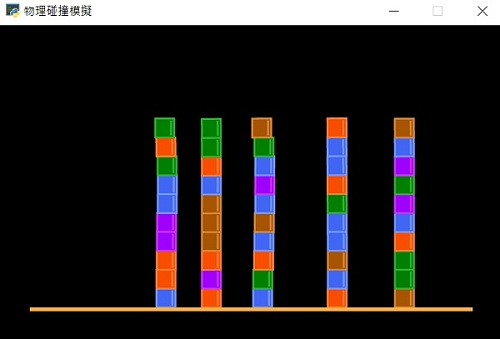
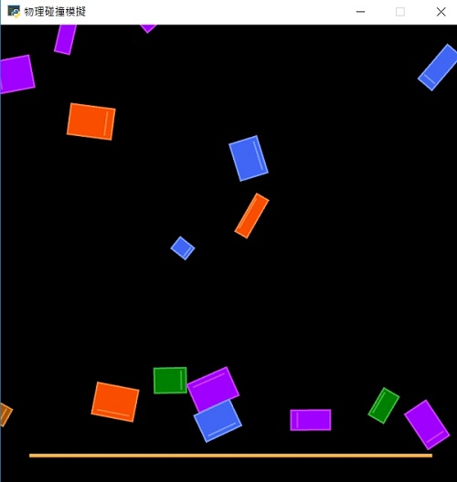

# Ⓜ️ 物理碰撞 學習模組

這個學習模組是建立在[pymunk](http://www.pymunk.org/en/latest/)的2D物理函式庫上，並利用[arcade](https://api.arcade.academy/en/latest/)函式庫繪圖。可以建立基本形狀(圓形、方形)，控制物體的基本物理量(質量、摩擦力等)，改變環境的重力。這就是憤怒鳥類型遊戲的模擬原理。

💬物理模組輔助功能，按住Ctrl及Alt鍵時，會顯示畫面座標，並可利用滑鼠右鍵新增、移除地形

| 範例                             | 截圖                                                              |
| :-----------:                    | :------------------------------------:                            |
| [無摩擦力](frictionless.md)          | [{width=150}](frictionless.md)           |
| [射擊測試](shoot.md)          | [{width=150}](shoot.md)           |
| [操控重力](gravity.md)          | [{width=150}](gravity.md)           |

