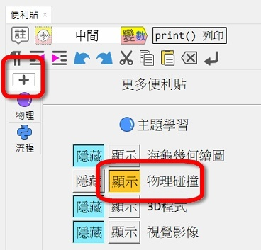

# Ⓜ️ 物理碰撞 學習模組

---------------

### 📗 說明

這個學習模組是建立在[pymunk](http://www.pymunk.org/en/latest/)的2D物理函式庫上，並利用[arcade](https://api.arcade.academy/en/latest/)函式庫繪圖。可以建立基本形狀(圓形、方形)，控制物體的基本物理量(質量、摩擦力等)，改變環境的重力。這就是憤怒鳥類型遊戲的模擬原理。

💬物理模組輔助功能，按住Ctrl及Alt鍵時，會顯示畫面座標，並可利用滑鼠右鍵新增、移除地形

---------------

### 📕 便利貼

以下為便利貼的使用資訊：

| 便利貼顯示                           | 便利貼內容                                                              |
| :-----------:                    | :------------------------------------:                            |
|     |     |

---------------

### 📘 範例

物理碰撞學習模組可以改變2D物體的彈性、摩擦，並以互動事件的方式，操控重力，做出有趣的物理模擬。

以下為相關的範例：

| 範例                             | 截圖                                                              |
| :-----------:                    | :------------------------------------:                            |
| [無摩擦力](frictionless.md)          | [{width=150}](frictionless.md)           |
| [射擊測試](shoot.md)          | [{width=150}](shoot.md)           |
| [操控重力](gravity.md)          | [{width=150}](gravity.md)           |

---------------

### 📙 原始碼

物理碰撞學習模組在:fontawesome-brands-github:github上的原始碼: [pie4t](https://github.com/beardad1975/pie4t)

