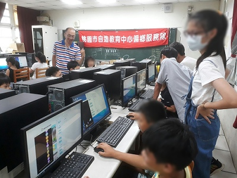
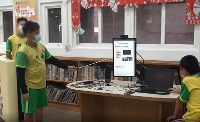
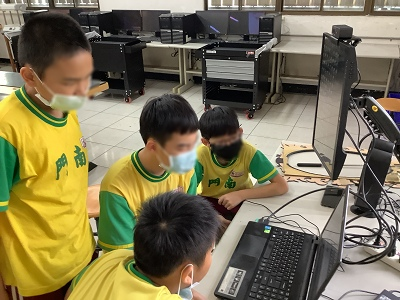
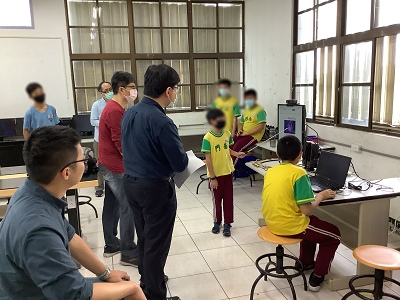
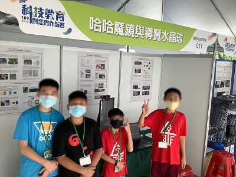
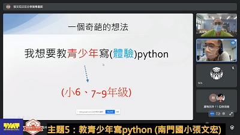
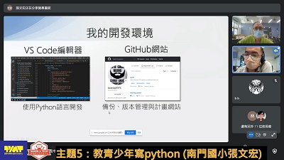
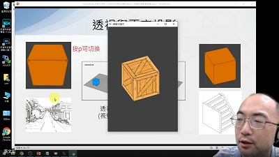
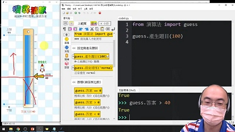

# 💙 活動紀錄

### 🧑2021年Py4t推廣紀錄

| 日期     | 單位或活動      |  形式  |  時數   | 內容            |
| :----:   | :-----:  | :----: | :----: |:----------:      |
| 2021-04-17  | 109學年度科技教育 創意實作競賽 國小資訊科技應用組佳作  | 創意實作競賽  | ---  | 用Py4t製作 哈哈魔鏡與導覽水晶球  |
| 2021-05-05  | 桃園市建國 自造教育及科技中心 | 教師研習  | 3小時  | 教青少年寫python 攝影機與視覺影像程式   |
| 2021-05-12  | 新竹縣博愛 自造教育及科技中心  | 教師研習  | 3小時  | Python與Microbit程式設計 數位聲音訊號入門與實作   |
| 2021-05-26  | 桃園市建國 自造教育及科技中心 | 線上教師研習  | 3小時  | 教青少年寫python 3D程式與迷你麥塊實作   |
| 2021-06-18  | 桃園市建國 自造教育及科技中心  | 科技教育嘉年華 線上成果展  | 30分鐘  | 教青少年寫Python Py4t的開發構想與軟體展示  |
| 2021-07  | 桃園市立桃園高級中學 吳老師  | 暑期銜接課程  | --- | 108新課綱 資訊科技銜接課程 海龜幾何繪圖與視覺影像   |
| 2021-07-23  | 臺北市新興 自造教育及科技中心  | 線上教師研習  | 3小時  | 用Py4t學Python 3D程式與影像處理   |
| 2021-07-27  | 新竹縣博愛 自造教育及科技中心  | 線上教師研習  | 3小時  | 教青少年寫python 3D程式與迷你麥塊實作   |
| 2021-07-30  | 臺北市新興 自造教育及科技中心  | 線上教師研習  | 3小時  | 用Py4t教懂演算法 排序撲克與搜尋猜數   |
| 2021-09-14  | 新北市國民教育輔導團 國中科技領域  | 線上增能研習  | 2小時  | 圖形化程式語言到文字型 教學工具分享   |
| 2021-10-28  | 臺南市麻豆 自造教育及科技中心  | 教師增能研習  | 6小時  | Scratch導向Python Python與Microbit結合   |
| 2021-11-03  | 新竹縣博愛 自造教育及科技中心  | 教師增能研習  | 3小時  | Py4t演算法教學 排序撲克與搜尋猜數   |
| 2021-11-13  | 桃園市龜山區大埔國小  | 學生創客營隊  | 6小時  | 3D列印與Python程式設計     |

###　👩2020年Py4t推廣紀錄

| 日期     | 單位或活動      |  形式  |  時數   | 內容            |
| :----:   | :-----:  | :----: | :----: |:----------:      |
| 2020-06-10  | 桃園市建國 自造教育及科技中心 | 教師研習  | 3小時  | Python程式語言入門   |
| 2020-07-17  | 桃園市觀音區樹林國小  | 學生創客營隊 |  1小時   | Py4t物理碰撞教學  |
| 2020-07-22  | 桃園市復興區介壽國小  | 學生創客營隊 |  1小時   | Py4t物理碰撞教學   |
| 2020-07-27  | 雲林縣斗六 自造教育及科技中心  | 參訪交流活動  | 30分鐘  | Py4t的介紹與實施簡報  |
| 2020-11-04  | 新竹縣博愛 自造教育及科技中心  | 教師研習  | 3小時  | 數學幾何繪圖 與物理碰撞模擬   |
| 2020-11-11  | 新竹縣博愛 自造教育及科技中心  | 教師研習  | 3小時  | 視窗自動化、影像處理 與chrome小恐龍機器人   |

### 👩學生創客營隊

於學生創客營隊中，實施Py4t體驗活動，雖然只有用到短暫的時間，但是利用Py4t有趣的物理碰撞模組，讓學生體驗Python程式。

| 學生創客營隊     |   活動照片    |  
| :----:   | :-----:  |
|    |   |
|    |   |

### 👩創意實作競賽

利用Py4t的視覺、3D與語音模組，製作哈哈魔鏡與導覽水晶球作品，參加科技教育創意實作競賽

| 創意實作競賽     |   活動照片    |  
| :----:   | :-----:  |
|    |   |
|    |   |

### 🧑線上成果展

配合桃園市建國自造教育及科技中心，在科技教育嘉年華線上成果展中簡報Py4t的開發現況、模組展示與未來方向

| 線上成果展     |   活動照片    |  
| :----:   | :-----:  |
|    |   |
|    |   |

### 🧑實體教師研習 

從教師研習中，講解與實作Py4t程式，與老師面對面的交流，聽取軟體使用回饋。

| 實體教師研習     |   活動照片    |  
| :----:   | :-----:  |
|    |   |
|    |   |

### 👩線上教師研習

因疫情關係，教師研習改採線上方式，雖不能面對面交流，但是能有更多人參與和試用與課程錄影紀錄，也是辦理推廣研習的好方式。

| 線上教師研習     |   活動照片    |  
| :----:   | :-----:  |
|    |   |
|    |   |
