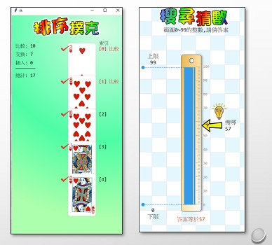

# 🕛 演算法

以2021-07-30研習「用Py4t教懂演算法-排序撲克與搜尋猜數」為主，將之拆為多個部分，以方便學習與參考

研習課程資料的[下載連結](https://reurl.cc/MAgMR4)，亦提供參考

### 🔰 研習開場與演算法簡介

> 教學內容:

> - Py4t 0.8版與感謝
> - 廣義的演算法
> - 學術的演算法
> - 演算法特性
> - 自然語言與形式語言
 
> 教學影片: 

> - 共9分48秒

<iframe width="949" height="534" src="https://www.youtube.com/embed/rBS7-FxIe0U" title="YouTube video player" frameborder="0" allow="accelerometer; autoplay; clipboard-write; encrypted-media; gyroscope; picture-in-picture" allowfullscreen></iframe>

-------------------------------------------------

### 🔰 正多邊形

> 教學內容:

> - 程式實作: 正多邊形
> - for迴圈與函式
> - 歸納與演繹
> - 程式設計法則DRY
> - 文字轉語音
 
> 教學影片: 

> - 共36分36秒

<iframe width="949" height="534" src="https://www.youtube.com/embed/qKEZXx2wSUU" title="YouTube video player" frameborder="0" allow="accelerometer; autoplay; clipboard-write; encrypted-media; gyroscope; picture-in-picture" allowfullscreen></iframe>

-----------------------------------------------

### 🔰 排序撲克與布題

> 教學內容:

> - 常見的演算法體驗活動
> - 排序撲克基本操作
> - 隨機與布題
 
> 教學影片: 

> - 共18分12秒

<iframe width="949" height="534" src="https://www.youtube.com/embed/9E3SlZZ4LhA" title="YouTube video player" frameborder="0" allow="accelerometer; autoplay; clipboard-write; encrypted-media; gyroscope; picture-in-picture" allowfullscreen></iframe>

-------------------------------------------------

### 🔰 人腦排序法(非正式)

> 教學內容:

> - 程式實作:人腦排序法
> - 人腦排序法的問題
> - 人眼視野與程式視野
 
> 教學影片: 

> - 共12分5秒

<iframe width="949" height="534" src="https://www.youtube.com/embed/iyqAVj93Mpk" title="YouTube video player" frameborder="0" allow="accelerometer; autoplay; clipboard-write; encrypted-media; gyroscope; picture-in-picture" allowfullscreen></iframe>

-------------------------------------------------

### 🔰 氣泡排序法 實作

> 教學內容:

> - 程式實作:氣泡排序法
> - 問題拆解
> - 排序主結構
 
> 教學影片: 

> - 共33分15秒

<iframe width="949" height="534" src="https://www.youtube.com/embed/TJLzCgBQlgY" title="YouTube video player" frameborder="0" allow="accelerometer; autoplay; clipboard-write; encrypted-media; gyroscope; picture-in-picture" allowfullscreen></iframe>

-------------------------------------------------

### 🔰 演算法評估、插入與選擇排序 

> 教學內容:

> - 時間複雜度
> - 演算法評估教學建議
> - 插入排序法
> - 選擇排序法
 
> 教學影片: 

> - 共16分16秒

<iframe width="949" height="534" src="https://www.youtube.com/embed/NDJaOEct7Uc" title="YouTube video player" frameborder="0" allow="accelerometer; autoplay; clipboard-write; encrypted-media; gyroscope; picture-in-picture" allowfullscreen></iframe>

-------------------------------------------------

### 🔰 搜尋猜數與線性搜尋

> 教學內容:

> - 搜尋猜數基本操作
> - 程式實作:線性搜尋法
> - 線性搜尋法評估
 
> 教學影片: 

> - 共12分03秒

<iframe width="949" height="534" src="https://www.youtube.com/embed/0vD6XwDgOgs" title="YouTube video player" frameborder="0" allow="accelerometer; autoplay; clipboard-write; encrypted-media; gyroscope; picture-in-picture" allowfullscreen></iframe>

-------------------------------------------------

### 🔰 二元搜尋

> 教學內容:

> - 程式實作: 二元搜尋法
> - 二元搜尋法評估
 
> 教學影片: 

> - 共14分40秒

<iframe width="949" height="534" src="https://www.youtube.com/embed/tO2shRFf2_Y" title="YouTube video player" frameborder="0" allow="accelerometer; autoplay; clipboard-write; encrypted-media; gyroscope; picture-in-picture" allowfullscreen></iframe>

-------------------------------------------------

### 🔰 重新思考與研習結語

> 教學內容:

> - 大學演算法課程的先備知識
> - 教學現況與重新思考
> - Python之禪

 
> 教學影片: 

> - 共9分7秒

<iframe width="949" height="534" src="https://www.youtube.com/embed/cs1heHwysA8" title="YouTube video player" frameborder="0" allow="accelerometer; autoplay; clipboard-write; encrypted-media; gyroscope; picture-in-picture" allowfullscreen></iframe>