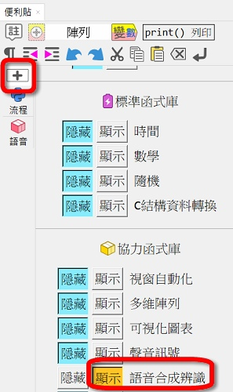
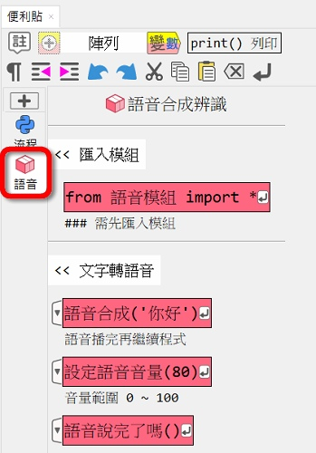
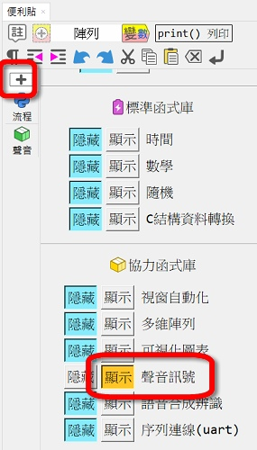
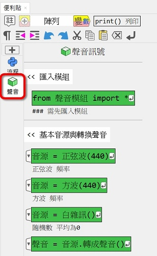

# Ⓜ️ 語音與聲音 模組

---------------

### 📗 說明

語音模組有分成文字轉語音的功能及語音辨識。

文字轉語音使用了windows內建的SAPI介面，可離線使用。

語音辨識則是將[speech_recognition](https://github.com/Uberi/speech_recognition#readme)函式庫包裝成學習模組來使用，因語音辨識的機制使用google的服務，會需要使用網路，經麥克風錄音後再上傳聲音檔，所以速度會稍慢一些

聲音模組可以做簡易的文字轉語音與語音辨識的功能

💬電腦上要有喇叭與麥克風。語音辨識使用google需連網

---------------

### 📘 範例

| 範例                             | 
| :-----------:                    | 
| [ 文字轉語音 - 語音合成叫號效果 ](tts.md)          | 
| [ 語音辨識 - 語音發牌 ](speech_recog.md)          |

---------------

### 📕 便利貼

以下為便利貼的使用資訊(語音、聲音)：

| 便利貼顯示                        | 便利貼內           |
| :-----------:                    | :------------------------------------:      |
|     |     |
|     |     |

---------------

### 📙 模組原始碼

聲音模組在:fontawesome-brands-github:github上的原始碼: [audio4t](https://github.com/beardad1975/audio4t)

語音模組在:fontawesome-brands-github:github上的原始碼: [speech4t](https://github.com/beardad1975/speech4t)

