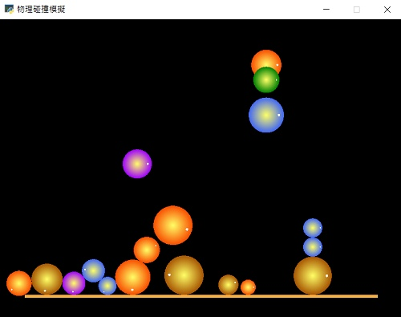

# 📚Py4t學習單元 - 力與運動遊樂場

----------------------------

###  📙 新增圓球

:  

: 利用基本的程式來產生物理舞台，按下滑鼠後可以新增圓球。

: 一起動手來寫程式吧！

??? example "Let's Code 滑鼠事件新增圓球"

     :fontawesome-solid-link: <a href="../../turtle4t/xxx/" target="_blank">xxx</a>

    

----------------------------

###  📙 彈性: 恢復係數

: 如何知道一顆球的彈性好不好呢？
 
<iframe width="560" height="315" src="https://www.youtube.com/embed/_RWqefx0vAg?start=95&amp;end=190" frameborder="0" allow="accelerometer; autoplay; encrypted-media; gyroscope; picture-in-picture" allowfullscreen></iframe>
 
: 恢復係數可衡量兩個物體在碰撞後的反彈程度[^1]。
: 以碰撞後與碰撞前相對速度的比值來定義[^2]。

 [^1]: 維基百科 https://zh.wikipedia.org/wiki/%E6%81%A2%E5%A4%8D%E7%B3%BB%E6%95%B0

 [^2]: 科學Online https://highscope.ch.ntu.edu.tw/wordpress/?p=18801

----------------------------

: 讓我們用程式來模擬各種彈性球吧！

??? example "Let's Code 球與恢復係數"

     :fontawesome-solid-link: <a href="../../turtle4t/xxx/" target="_blank">xxx</a>

----------------------------

