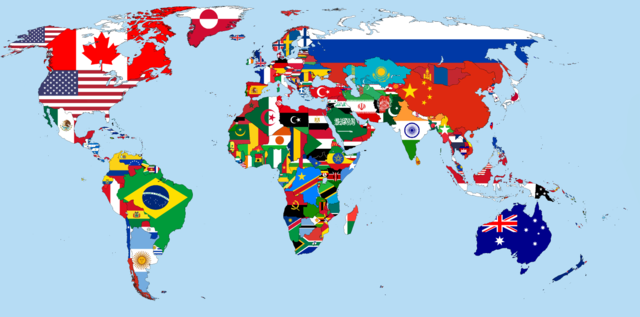

---
hide:
  - toc
---

# 📚教學 - 海龜畫國旗

----------------------------

###  畫出方形(矩形)

??? example "Let's Code 程式實作"

    [ 海龜範例 - 畫出正方形 ](../../turtle4t/draw_square.md)

??? question "想一想，試一試"

    如何讓海龜畫出長方形？

    正方形與長方形有什麼不同？

    

----------------------------

###  國旗出現的場合 

: [:fontawesome-brands-youtube: 2020東京奧運男子羽球雙打金牌頒獎](https://www.youtube.com/watch?v=FX5F3pk5MWU)

: <iframe width="480" height="270" src="https://www.youtube.com/embed/FX5F3pk5MWU" title="YouTube video player" frameborder="0" allow="accelerometer; autoplay; clipboard-write; encrypted-media; gyroscope; picture-in-picture" allowfullscreen></iframe>

    

----------------------------

###  世界各國的國旗

: 

: (圖片來源[^1])

[^1]: 由 H8edge - 自己的作品, CC BY-SA 4.0, https://commons.wikimedia.org/w/index.php?curid=68410306

----------------------------

: [ :fontawesome-solid-link: 維基百科 國旗列表](https://zh.wikipedia.org/wiki/%E5%9C%8B%E6%97%97%E5%88%97%E8%A1%A8) - 列舉世界上主權國家的國旗

    

----------------------------

###  由方形組成的國旗

----------------------------

###  與圓形相關的國旗

----------------------------

###  與星形相關的國旗

----------------------------

--8<-- "includes/abbreviations.md"

