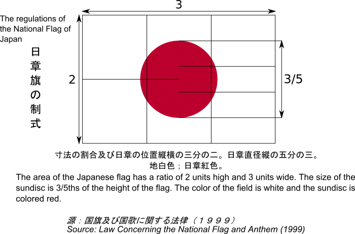

---
hide:
  - toc
---

# 📚教學 - 海龜畫國旗

----------------------------

###  畫出方形(矩形)

: 如何讓程式畫出正方形？以海龜的角度來看，正方形的規律是什麼？

??? example "Let's Code 正方形"

     [ 海龜範例 - 畫出正方形 ](../../turtle4t/draw_square.md)

??? question "更多"

    如何讓海龜畫出長方形？

    正方形的規律是「向前走與轉直角並重複4次」，想一想，長方形的規律是什麼？試著讓海龜程式畫出長方形吧！

    

----------------------------

###  國旗出現的場合 

: [:fontawesome-brands-youtube: 2020東京奧運男子羽球雙打金牌頒獎](https://www.youtube.com/watch?v=FX5F3pk5MWU)

: <iframe width="480" height="270" src="https://www.youtube.com/embed/FX5F3pk5MWU" title="YouTube video player" frameborder="0" allow="accelerometer; autoplay; clipboard-write; encrypted-media; gyroscope; picture-in-picture" allowfullscreen></iframe>

    

----------------------------

###  世界各國的國旗

: 

: (圖片來源[^1])

[^1]: 由 H8edge - 自己的作品, CC BY-SA 4.0, https://commons.wikimedia.org/w/index.php?curid=68410306

----------------------------

: [ :fontawesome-solid-link: 維基百科 國旗列表](https://zh.wikipedia.org/wiki/%E5%9C%8B%E6%97%97%E5%88%97%E8%A1%A8) - 列舉世界上主權國家的國旗

    

----------------------------

###  方形相關的國旗

: 

: [ :fontawesome-solid-link: 維基百科 法國國旗](https://zh.wikipedia.org/wiki/%E6%B3%95%E5%9B%BD%E5%9B%BD%E6%97%97) - 簡介與規格

??? example "Let's Code 法國國旗"

     [ 海龜範例 - 法國國旗 ](../../turtle4t/#)

??? question "更多"

    如何讓海龜畫出與方形相關國旗？

    請從 [ :fontawesome-solid-link: 維基百科 國旗列表](https://zh.wikipedia.org/wiki/%E5%9C%8B%E6%97%97%E5%88%97%E8%A1%A8)中，找到由長方形或正方形組成的國旗，依據國旗的說明與規格，試著用海龜程式畫出來。(如中歐地區的德國)

   

----------------------------

###  圓形相關的國旗

: 

: (圖片來源[^2])

[^2]: Zscout370 - 投稿者自身による作品, based on http://law.e-gov.go.jp/htmldata/H11/H11HO127.html, CC 表示-継承 4.0, https://commons.wikimedia.org/w/index.php?curid=3109313による

??? info "海龜座標"

     海龜座標

??? info "下筆停筆"

     下筆停筆

??? example "Let's Code 日本國旗"

     [ 海龜範例 - 日本國旗 ](../../turtle4t/#)

   

----------------------------

###  星形相關的國旗

----------------------------

--8<-- "includes/abbreviations.md"

