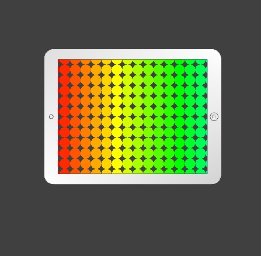

---
hide:
  - navigation
---

# 🔰 3D程式範例 - 彩色漸層

--------------

: 

<br/>

-------------------------------------

## 階段1: 虛擬螢幕

🎦 範例影片

: 建構中

📄 Py4t程式碼

```python
from 模擬3D模組 import *

for x in range(16) :
    for y in range(12) :
        物體 = 新增圓形平面()
        物體.位置 = [x,y,0]
        物體.顏色 = color.red

框 = 新增方形平面()
框.材質貼圖 = '平板外框.png'
框.縮放 = [16*1.2, 12*1.2, 1]
框.位置 = [15/2, 11/2, 0]

模擬主迴圈()
```

: 註: 材質貼圖檔需匯入。

<br/><br/>


-------------------------------------

## 階段2: 彩色漸層

🎦 範例影片

: 建構中

📄 Py4t程式碼

```python
from 模擬3D模組 import *

for x in range(16) :
    for y in range(12) :
        物體 = 新增圓形平面()
        物體.位置 = [x,y,0]
        物體.顏色 = color.hsv(x*10, 1, 1)
        
框 = 新增方形平面()
框.材質貼圖 = '平板外框.png'
框.縮放 = [16*1.2, 12*1.2, 1]
框.位置 = [15/2, 11/2, 0]

模擬主迴圈()
```

: 註: 材質貼圖檔需匯入。

