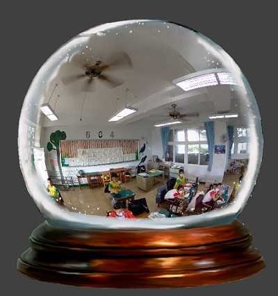

---
hide:
  - navigation
---

# 🔰 3D程式範例 - 全景水晶球

--------------

: 

<br/>

## 階段1: 360全景相片

🎦 範例影片

: <iframe width="560" height="315" src="https://www.youtube.com/embed/hogWFR9Z094?start=0&amp;end=235" frameborder="0" allow="accelerometer; autoplay; encrypted-media; gyroscope; picture-in-picture" allowfullscreen></iframe>

📄 Py4t程式碼

```python
from 模擬3D模組 import *

物體 = 新增內面貼圖球體()
物體.材質貼圖 = '教室360.jpg'
物體.縮放 = 5

def 當更新時(dt):
    物體.旋轉y += 0.1
    
模擬主迴圈()
```

: 註: 材質貼圖檔需匯入並修改。

<br/><br/>

----------------------------------

## 階段2: 全景水晶球

🎦 範例影片

: <iframe width="560" height="315" src="https://www.youtube.com/embed/hogWFR9Z094?start=238&amp;end=559" frameborder="0" allow="accelerometer; autoplay; encrypted-media; gyroscope; picture-in-picture" allowfullscreen></iframe>

📄 Py4t程式碼

```python
from 模擬3D模組 import *
舞台 = 模擬3D引擎(800,800)

水晶球 = 新增內面貼圖球體()
水晶球.材質貼圖 = '教室360.jpg'
水晶球.縮放 = 5

外框 = 新增方形平面()
外框.材質貼圖 = '水晶球外框.png'
外框.親代 = 舞台.使用者介面
外框.縮放 = 0.8
外框.位置y = -0.03

def 當更新時(dt):
    水晶球.旋轉y += 0.1
    
模擬主迴圈()
```

: 註: 材質貼圖檔需匯入並修改。