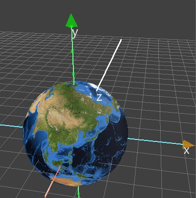

---
hide:
  - navigation
---

# 🔰 3D程式範例 - 轉動地球


: 

<br/>

-------------------------------------

## 階段1: 地球自轉

🎦 範例影片

: <iframe width="560" height="315" src="https://www.youtube.com/embed/-lC84lJOQuE?start=2&amp;end=424" frameborder="0" allow="accelerometer; autoplay; encrypted-media; gyroscope; picture-in-picture" allowfullscreen></iframe>

📄 Py4t程式碼

```python
from 模擬3D模組 import *

地球 = 新增球體()
地球.材質貼圖 = '地球.jpg'
地球.縮放 = 5

def 當更新時(dt):
    地球.旋轉y -= 0.1
    
模擬主迴圈()
```

: 註: 材質貼圖檔需匯入在相同資料夾。

<br/><br/>

-----------------------------------

## 階段2: 地球傾斜

🎦 範例影片

: <iframe width="560" height="315" src="https://www.youtube.com/embed/-lC84lJOQuE?start=428&amp;end=613" frameborder="0" allow="accelerometer; autoplay; encrypted-media; gyroscope; picture-in-picture" allowfullscreen></iframe>

📄 Py4t程式碼

```python
from 模擬3D模組 import *

自轉軸 = 新增直線()
自轉軸.旋轉z = 23.5

地球 = 新增球體()
地球.材質貼圖 = '地球.jpg'
地球.縮放 = 5
地球.親代 = 自轉軸

def 當更新時(dt):
    地球.旋轉y -= 0.1
    
模擬主迴圈()
```

: 註: 材質貼圖檔需匯入在相同資料夾。