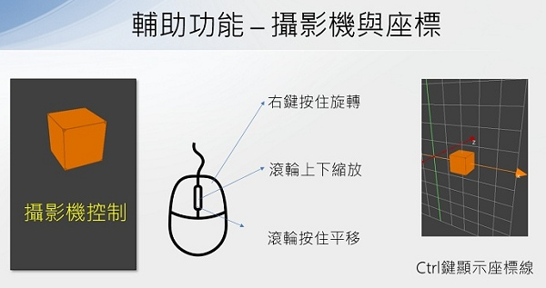

# 🔰 3D範例 - 3D方塊

### 🎦 範例影片

<div style="padding:75% 0 0 0;position:relative;"><iframe src="https://player.vimeo.com/video/584289430?badge=0&amp;autopause=0&amp;player_id=0&amp;app_id=58479" frameborder="0" allow="autoplay; fullscreen; picture-in-picture" allowfullscreen style="position:absolute;top:0;left:0;width:100%;height:100%;" title="first_3d.mp4"></iframe></div><script src="https://player.vimeo.com/api/player.js"></script>

### 🏷️ 原理說明

建立一個3D方塊



--------------

### 📄 Py4t程式碼

```python
from 模擬3D模組 import *

物體 = 新增立方體()
物體.顏色 = 色彩.orange

模擬主迴圈()
```

--------------

### 💻 執行截圖


