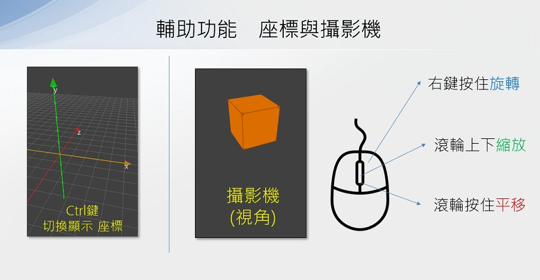
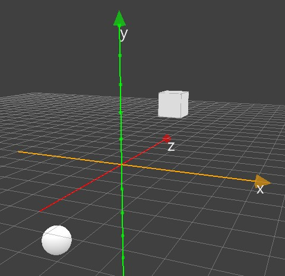
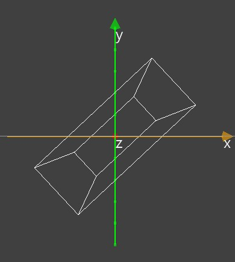
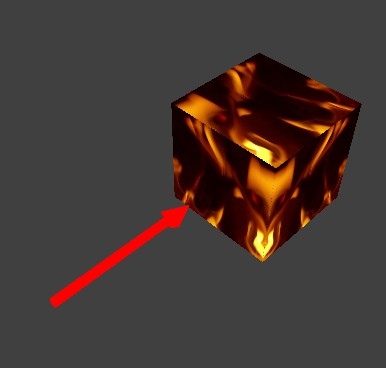
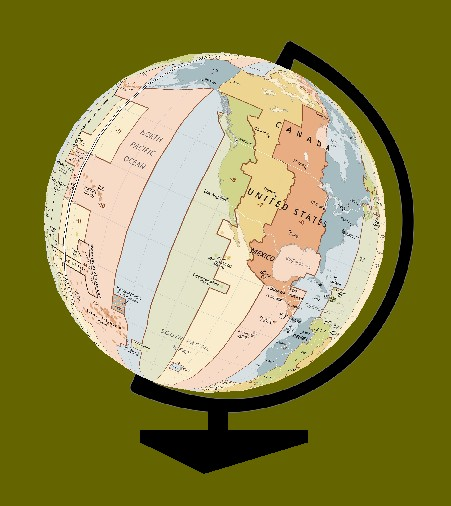
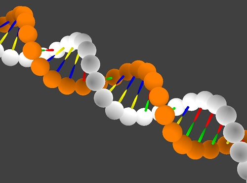

---
hide:
  - navigation
---

# 🧊 3D 教學函式庫

---------------

### 📗 說明

---------------


3D教學函式庫是建立在[panda3d](https://www.panda3d.org/)與[ursina](https://www.ursinaengine.org/)的3D函式庫上。可以建立長方體及圓球等模型放置在3D空間中，並改變模型貼圖、控制位置、旋轉。3D程式是3D遊戲、3D動畫、VR與AR的基本技術。

此函式庫可以學習空間座標、模型的材質貼圖、模型的縮放與旋轉等概念，並可利用事件處理函式，讓模型做出動作。

: {width=700}

<br>

??? info "ursina的官方說明"

     :fontawesome-solid-link: <a href="https://www.ursinaengine.org/documentation.html" target="_blank">ursina documentation</a>

??? info "panda3d的官方說明"

     :fontawesome-solid-link: <a href="https://docs.panda3d.org/1.10/python/index" target="_blank">panda3d manual</a>


<br/><br/>

---------------

### 📕 基本用法

---------------

```python
from 模擬3D模組 import *

# 舞台設置或初始設置(一次)

# 事件處理函式
### 如「當更新時」函式
### 當事件發生時即會執行

模擬主迴圈()
```

在開頭匯入「模擬3D模組」，最後加上「模擬主迴圈」函式，中間程式可以做舞台設置或初始設置(一次)，也可以加入「事件處理函式」，來決定相關事件發生時，要做的動作。

<br/><br/>

---------------

### 📕 便利貼

---------------

使用便利貼，拖曳後就會貼上程式碼，降低文字程式的學習難度。

| 便利貼顯示                           | 便利貼內容                                                              |
| :-----------:                    | :------------------------------------:                            |
|     |     |


<br/><br/>


---------------

### 📘 範例程式

---------------

各種以3D教學函式庫做出的程式範例。

| 範例                             | 截圖                                                              |
| :-----------:                    | :------------------------------------:                            |
| [3D方塊](first_3d.md)          | [{width=150}](first_3d.md)           |
| [彩色方陣](color_array.md)          | [{width=150}](color_array.md)           |
| [彩色螺旋](color_spiral.md)          | [{width=150}](color_spiral.md)           |
| [太陽系](solar_system.md)          | [{width=150}](solar_system.md)           |
| [空間座標與位置](coor_and_position.md)          | [{width=150}](coor_and_position.md)           |
| [3軸縮放與旋轉](scale_and_rotate.md)          | [{width=150}](scale_and_rotate.md)           |
| [顏色與材質貼圖](color_and_texture.md)          | [{width=150}](color_and_texture.md)           |
| [轉動地球](earth_rotation.md)          | [{width=150}](earth_rotation.md)           |
| [地球儀](globe.md)          | [{width=150}](globe.md)           |
| [漸層螢幕](color_gradient.md)          | [{width=150}](color_gradient.md)           |
| [全景水晶球](crystal_ball.md)          | [{width=150}](crystal_ball.md)           |
| [魔術方塊](rubik_cube.md)          | [{width=150}](rubik_cube.md)           |
| [DNA與遺傳編碼](dna_genetic_code.md)          | [{width=150}](dna_genetic_code.md)           |

<br/><br/>


---------------

### 📒 入門課程

---------------


學習3D程式，做出地球模型、彩色漸層、全景水晶球與魔術方塊。
:fontawesome-solid-long-arrow-alt-right: <a href="../lesson/explore3d/" target="_blank">「探索3D空間」</a>

<br/><br/>


---------------

### 📙 原始碼與套件

---------------


3D 教學函式庫 在:fontawesome-brands-github:github上的原始碼: [threed4t](https://github.com/beardad1975/threed4t)

3D 教學函式庫 在PyPI上發布的套件: [threed4t](https://pypi.org/project/threed4t/)，可使用pip install threed4t安裝

<br/><br/>


