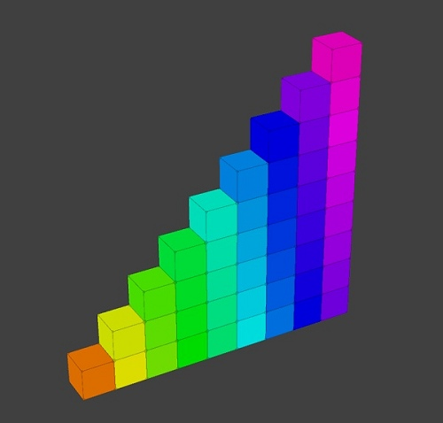
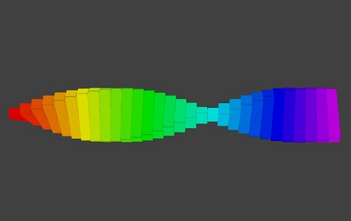
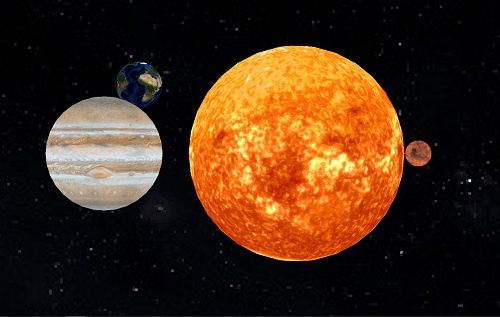
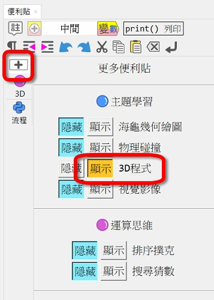
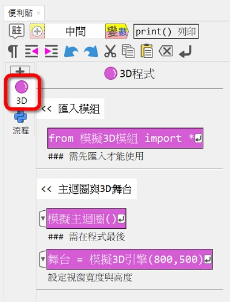

---
hide:
  - navigation
---

# Ⓜ️ 立體3D模組

---------------

### 📗 說明

這個學習模組是建立在[panda3d](https://www.panda3d.org/)與[ursina](https://www.ursinaengine.org/)的3D函式庫上。可以建立長方體及圓球等模型放置在3D空間中，並改變模型貼圖、控制位置、旋轉。3D程式是3D遊戲、3D動畫、VR與AR的基本技術。

3D學習模組可以學習空間座標、模型的材質貼圖、模型的縮放與旋轉等概念，並可利用事件處理函式，讓模型做出動作。

---------------

### 📘 立體3D 程式範例

| 範例                             | 截圖                                                              |
| :-----------:                    | :------------------------------------:                            |
| [3D方塊](first_3d.md)          | [{width=150}](first_3d.md)           |
| [彩色方陣](color_array.md)          | [{width=150}](color_array.md)           |
| [彩色螺旋](color_spiral.md)          | [{width=150}](color_spiral.md)           |
| [太陽系](solar_system.md)          | [{width=150}](solar_system.md)           |

---------------

### 📕 便利貼

以下為便利貼的使用資訊：

| 便利貼顯示                           | 便利貼內容                                                              |
| :-----------:                    | :------------------------------------:                            |
|     |     |

---------------

### 📙 模組原始碼

3D學習模組在:fontawesome-brands-github:github上的原始碼: [threed4t](https://github.com/beardad1975/threed4t)

