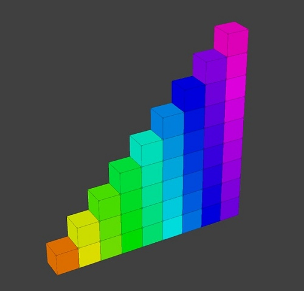
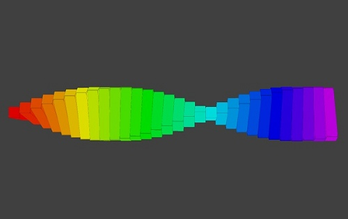

# Ⓜ️ 3D模擬 學習模組

這個學習模組是建立在[panda3d](https://www.panda3d.org/)與[ursina](https://www.ursinaengine.org/)的3D函式庫上。可以建立長方體及圓球等模型放置在3D空間中，並改變模型貼圖、控制位置、旋轉。3D程式是3D遊戲、3D動畫、VR與AR的基本技術。

| 範例                             | 截圖                                                              |
| :-----------:                    | :------------------------------------:                            |
| [3D方塊](first_3d.md)          | [{width=150}](first_3d.md)           |
| [彩色方陣](color_array.md)          | [{width=150}](color_array.md)           |
| [彩色螺旋](color_spiral.md)          | [{width=150}](color_spiral.md)           |

