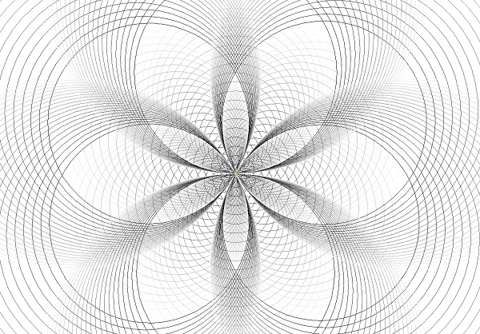

# 🔰 海龜範例 - 圓形禪繞畫

--------------

### 🎦 範例影片

<div style="padding:75% 0 0 0;position:relative;"><iframe src="https://player.vimeo.com/video/645029345?h=7986c82a24&amp;badge=0&amp;autopause=0&amp;player_id=0&amp;app_id=58479" frameborder="0" allow="autoplay; fullscreen; picture-in-picture" allowfullscreen style="position:absolute;top:0;left:0;width:100%;height:100%;" title="circle_zentangle.mp4"></iframe></div><script src="https://player.vimeo.com/api/player.js"></script>


--------------

### 🏷️ 原理說明
禪繞畫是一種全新的繪畫方式，在設定好的空間內用不斷重複的基本圖形來創作出美麗圖案。

本範例利用海龜的圓形，變化大小、深淺色及位置重複的繪圖，畫出類似禪繞畫的感覺，看著圖案重複的畫出與疊加，是不是覺得很特別呢？

---------------------------

### 📄 Py4t程式碼
```python
from 海龜模組 import *
import random as 隨機

速度('fastest')
視窗設定(1200, 800)

右轉(60)
while True :    
    for 數 in range(100) : 
        亮度 = 數 * 10 % 255
        畫筆顏色(亮度,亮度,亮度)
        畫圓(數*3)
        
    右轉(60)
```

---------------------------

### 💻 執行截圖




