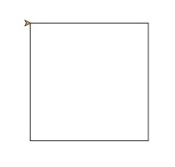

# 🔰 海龜範例 - 畫出正方形

--------------

### 🎦 示範影片

<iframe width="896" height="504" src="https://www.youtube.com/embed/Wh7ExxELMYg" title="YouTube video player" frameborder="0" allow="accelerometer; autoplay; clipboard-write; encrypted-media; gyroscope; picture-in-picture" allowfullscreen></iframe>

--------------

### 🏷️ 原理說明

正方形有4個邊及4個角。當我們利用for迴圈重複4次，讓海龜重複前進與轉直角的動作，即可畫出正方形

--------------

### 📄 Py4t程式碼

```python
from 海龜模組 import *

for 數 in range(4) :
    向前(50)
    右轉(90)
```

--------------

### 💻 執行截圖




