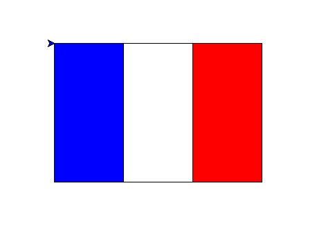

# 🔰 海龜範例 - 法國國旗

--------------

### 🎦 示範影片

<iframe width="896" height="504" src="https://www.youtube.com/embed/GKyYdbDMH1A" title="YouTube video player" frameborder="0" allow="accelerometer; autoplay; clipboard-write; encrypted-media; gyroscope; picture-in-picture" allowfullscreen></iframe>

--------------

### 🏷️ 重點說明
法國國旗的長寬比為3:2，由左到右為藍、白、紅色。

先讓海龜重複2次畫出3:2的長方形，將長方形填上紅色(利用開始填色及停止填色)
，接著畫出2:2的方形，填上白色，最後畫出1:2的方形，填上藍色，就完成了

<br/><br/>

--------------

### 📄 Py4t程式碼

```python
from 海龜模組 import *
視窗設定(800, 600)

# 紅色長方形 寬高比3:2
填充顏色('red')
開始填色()
for 數 in range(2) :
    向前(300)
    右轉(90)
    向前(200)
    右轉(90)
停止填色()

# 白色長方形 寬高比2:2
填充顏色('white')
開始填色()
for 數 in range(2) :
    向前(200)
    右轉(90)
    向前(200)
    右轉(90)
停止填色()

# 藍色長方形 寬高比1:2
填充顏色('blue')
開始填色()
for 數 in range(2) :
    向前(100)
    右轉(90)
    向前(200)
    右轉(90)
停止填色()
```

--------------

### 💻 執行截圖




