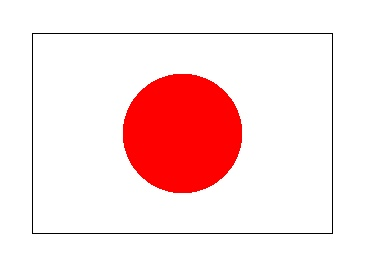

# 🔰 海龜範例 - 日本國旗

--------------

### 🎦 示範影片

<iframe width="896" height="504" src="https://www.youtube.com/embed/upF-HpneLPY" title="YouTube video player" frameborder="0" allow="accelerometer; autoplay; clipboard-write; encrypted-media; gyroscope; picture-in-picture" allowfullscreen></iframe>

--------------

### 🏷️ 重點說明

日本國旗的寬高比是3:2，先重複2次的寬高，來畫出3:2的長方形(程式採用左轉，讓座標值xy都為正)

停筆(避免海龜畫線)，先移動到國旗中心(座標為寬與高各一半的位置)

下筆(繼續畫線)後，畫出紅色圓形(直徑:高的3/5，且紅色rgb值為255, 0, 0)


--------------

### 📄 Py4t程式碼

```python
from 海龜模組 import *
視窗設定(800, 600)

# 長方形線條 寬高比3:2
for 數 in range(2) :
    向前(300)
    左轉(90)
    向前(200)
    左轉(90)

# 移動至長方形中心(不畫線)    
停筆()
走到(300/2,200/2)
下筆()

# 畫紅色實心圓
畫點(200*3/5, [255,0,0])
隱藏游標()
```

--------------

### 💻 執行截圖




