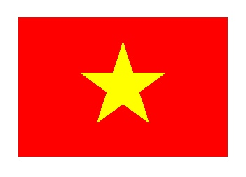

# 🔰 海龜範例 - 越南國旗

--------------

### 🎦 示範影片

<iframe width="560" height="315" src="https://www.youtube.com/embed/3Fa8GosgRIw" frameborder="0" allow="accelerometer; autoplay; encrypted-media; gyroscope; picture-in-picture" allowfullscreen></iframe>

--------------

### 🏷️ 重點說明

將視窗設定寬為800，高為600

畫出寬300，高200的長方形(使用左轉，可以讓座標在第1象限)，將長方形填滿紅色red

先下筆，接下來將海龜移至星形的起點座標90,120，然後再停筆

接著畫出5角星形，其規格為長度120，有5條線，右轉的外角為 180 – 180/5，設定填充顏色與畫筆顏色均為黃色，就會產生黃色5角星形。

隱藏游標，讓游標不會擋住星形，最後加上完成(可避色偶發的程式無回應)

--------------

### 📄 Py4t程式碼

```python
from 海龜模組 import *
視窗設定(800, 600)

# 畫出紅色長方形 寬高比3:2
填充顏色('red')
開始填色()
for 數 in range(2) :
    向前(300)
    左轉(90)
    向前(200)
    左轉(90)
停止填色()

# 移至星形起點
停筆()
走到(90,120)
下筆()

# 畫出黃色5角星形
填充顏色('yellow')
畫筆顏色('yellow')
開始填色()
for 數 in range(5) :
    向前(120)
    右轉(180 - 180 / 5)
停止填色()

隱藏游標()
完成()
```

--------------

### 💻 執行截圖




