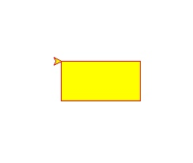
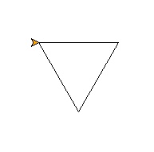
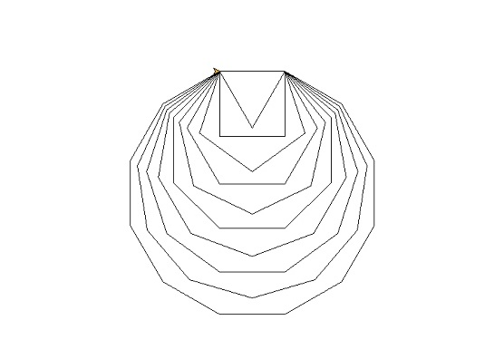
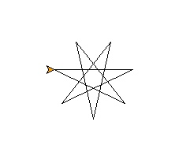
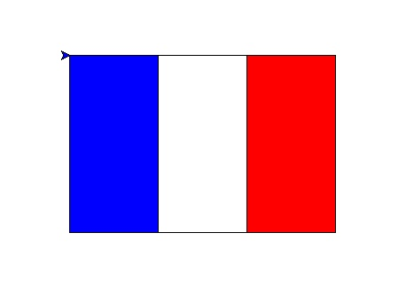
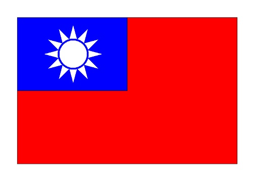
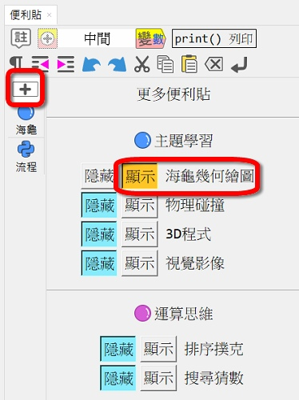
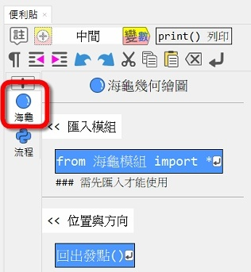

---
hide:
  - navigation
---

# Ⓜ️ 海龜 學習模組

---------------

### 📗 說明

---------------

海龜程式起源自1967年的Logo程式語言，是設計用來教孩子入門程式的語言。Python的標準函式庫有個海龜功能的turtle函式庫。Py4t為了橋接Scratch與Python，函式翻譯簡化，將其包裝成包含中文的學習模組。

海龜在直角座標平面上的各種移動，可以畫出線條、形狀。海龜的移動與旋轉組合可以畫出數學上的各種幾何圖形，適合做為python程式的入門學習工具。

??? info "turtle 參考資料"

     :fontawesome-solid-link: <a href="https://docs.python.org/3/library/turtle.html" target="_blank">turtle函式庫 說明 (Python網站)</a>

  

---------------

### 📘 範例

---------------

| 範例                             | 截圖                                                              |
| :-----------:                    | :------------------------------------:                            |
| [正方形](draw_square.md)          | [{width=150}](draw_square.md)           |
| [長方形及填色](rectangle_and_fill.md)          | [{width=150}](rectangle_and_fill.md)           |
| [正三角形](draw_triangle.md)          | [{width=150}](draw_triangle.md)           |
| [正多邊形](regular_polygon.md)    | [{width=150}](regular_polygon.md) |
| [奇數角星形](odd_number_star.md)               | [{width=150}](odd_number_star.md)                     |
| [法國國旗](flag_of_france.md)               | [{width=150}](flag_of_france.md)
| [日本國旗](flag_of_japan.md)               | [{width=150}](flag_of_japan.md)                      |
| [越南國旗](flag_of_vietnam.md)               | [{width=150}](flag_of_vietnam.md)                      |
| [專題 中華民國國旗](roc_flag.md)               | [{width=150}](roc_flag.md)                      |
| [螺旋形](spiral.md)               | [{width=150}](spiral.md)                     |
| [圓形禪繞畫](circle_zentangle.md)               | [{width=150}](circle_zentangle.md)                      |
| [碎形樹](fractal_tree.md)               | [{width=150}](fractal_tree.md)      |

  

---------------

### 📒 課程

---------------

學習海龜程式，畫出與方形、圓形、星形相關的國旗。　 :fontawesome-solid-long-arrow-alt-right: <a href="../lesson/national_flag/" target="_blank">進入「海龜畫國旗」</a>

  

---------------

### 📕 專題

---------------

程式專題：中華民國國旗

利用所學的基本形狀，畫出我們的國旗。　 :fontawesome-solid-long-arrow-alt-right: <a href="../lesson/national_flag/project_roc_flag/" target="_blank">進入專題</a>

  

---------------

### 📗 便利貼

---------------

以下為便利貼的使用方式：

| 便利貼顯示                           | 便利貼內容                                                              |
| :-----------:                    | :------------------------------------:                            |
|     |     |

  

---------------

### 📙 模組原始碼

---------------

海龜學習模組在:fontawesome-brands-github:github上的原始碼: [turtle4t](https://github.com/beardad1975/turtle4t)

