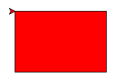

---
hide:
  - navigation
---

# 🐢 海龜 教學函式庫

---------------

### 📗 說明

---------------

海龜程式起源自1967年的Logo程式語言，是設計用來教孩子入門程式的語言。

在Scratch程式中的Logo實作是畫筆功能，而在Python的標準函式庫的Logo實作是turtle函式庫(海龜程式)。

Py4t為了橋接Scratch與Python，適合青少年學習，把函式翻譯簡化並將其包裝成包含中文的學習函式庫。

海龜在直角座標平面上的各種移動，可以畫出線條、形狀。海龜的移動與旋轉組合可以畫出數學上的各種幾何圖形，適合做為python程式的入門學習工具。

??? info "turtle的官方說明"

     :fontawesome-solid-link: <a href="https://docs.python.org/3/library/turtle.html" target="_blank">turtle函式庫 說明 (Python網站)</a>

<br/><br/>

---------------

### 📕 基本用法

---------------

```python
from 海龜模組 import *

#中間為畫線程式

完成()
```

在開頭匯入「海龜模組」，最後加上「完成」函式，中間程式會讓海龜產生動作，畫出各種線條與填色。

<br/><br/>

---------------

### 📗 便利貼

---------------

使用便利貼，拖曳後就會貼上程式碼，降低文字程式的學習難度：

| 便利貼顯示                           | 便利貼內容                                                              |
| :-----------:                    | :------------------------------------:                            |
|     |     |


<br/><br/>

---------------

### 📘 範例程式

---------------

各種以海龜教學函式庫做出的程式範例。

| 範例                 | 截圖                        |
| :-----------:        | :-----------------:        |
| [正方形](draw_square.md)          | [{width=150}](draw_square.md)           |
| [正三角形](draw_triangle.md)          | [{width=150}](draw_triangle.md)           |
| [正多邊形](regular_polygon.md)    | [{width=150}](regular_polygon.md) |
| [國旗基本元素](flag_element.md)     | [{width=150}](flag_element.md)           |
| [方形相關國旗 法國國旗](flag_of_france.md)               | [{width=150}](flag_of_france.md)
| [圓形相關國旗 日本國旗](flag_of_japan.md)               | [{width=150}](flag_of_japan.md)                      |
| [星形相關國旗 三角與星形](odd_number_star.md)               | [{width=150}](odd_number_star.md)                     |
| [星形相關國旗 越南國旗](flag_of_vietnam.md)               | [{width=150}](flag_of_vietnam.md)                      |
| [專題 中華民國國旗](roc_flag.md)               | [{width=150}](roc_flag.md)                      |
| [螺旋形](spiral.md)               | [{width=150}](spiral.md)                     |
| [圓形禪繞畫](circle_zentangle.md)               | [{width=150}](circle_zentangle.md)                      |
| [碎形樹](fractal_tree.md)               | [{width=150}](fractal_tree.md)      |


<br/><br/>


---------------

### 📒 入門課程

---------------

: 

學習海龜程式，畫出與方形、圓形、星形相關的國旗。　 :fontawesome-solid-long-arrow-alt-right: <a href="../lesson/national_flag/" target="_blank">進入「海龜畫國旗」</a>

<br/><br/>

---------------

### 📕 專題課程

---------------

: 

程式專題：中華民國國旗

利用所學的方形、圓形與星形，畫出我們的國旗。　 :fontawesome-solid-long-arrow-alt-right: <a href="../lesson/national_flag/project_roc_flag/" target="_blank">進入專題</a>

<br/><br/>


---------------

### 📙 原始碼與套件

---------------

海龜 教學函式庫 在:fontawesome-brands-github:github上的原始碼: [turtle4t](https://github.com/beardad1975/turtle4t)

海龜 教學函式庫 在PyPI上發布的套件: [turtle4t](https://pypi.org/project/turtle4t/) ，可使用pip install turtle4t安裝


