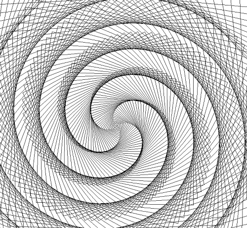

# 🔰 海龜範例 - 迴轉線條


: 

<br/>

-------------------------------------

## 階段1: 方陣擴大

🎦 範例影片

<iframe width="560" height="315" src="https://www.youtube.com/embed/jwwAbyi0Ang?start=2&amp;end=152" frameborder="0" allow="accelerometer; autoplay; encrypted-media; gyroscope; picture-in-picture" allowfullscreen></iframe>

📄 Py4t程式碼

```python
from 海龜模組 import *
速度('fastest')

for 數 in range(100) :
    向前(數)
    右轉(90)    

完成()
```

<br/><br/>


-------------------------------------

## 階段2: 長度迭代

🎦 範例影片

<iframe width="560" height="315" src="https://www.youtube.com/embed/jwwAbyi0Ang?start=155&amp;end=271" frameborder="0" allow="accelerometer; autoplay; encrypted-media; gyroscope; picture-in-picture" allowfullscreen></iframe>

📄 Py4t程式碼

```python
from 海龜模組 import *
速度('fastest')

for 數 in range(100) :
    向前(數-50)
    右轉(90)    

完成()
```

<br/><br/>

-------------------------------------

## 階段3: 角度迭代

🎦 範例影片

<iframe width="560" height="315" src="https://www.youtube.com/embed/jwwAbyi0Ang?start=273&amp;end=394" frameborder="0" allow="accelerometer; autoplay; encrypted-media; gyroscope; picture-in-picture" allowfullscreen></iframe>

📄 Py4t程式碼

```python
from 海龜模組 import *
速度('fastest')

for 數 in range(100) :
    向前(數)
    右轉(360/4 - 1)    

完成()
```

<br/><br/>

-------------------------------------

## 階段4: 玩轉禪繞

🎦 範例影片

<iframe width="560" height="315" src="https://www.youtube.com/embed/jwwAbyi0Ang?start=398&amp;end=535" frameborder="0" allow="accelerometer; autoplay; encrypted-media; gyroscope; picture-in-picture" allowfullscreen></iframe>

📄 Py4t程式碼

```python
from 海龜模組 import *
速度('fastest')

for 數 in range(500) :
    向前(數*2)
    右轉(360/4 + 1)    

完成()
```

<br/><br/>