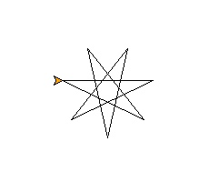

# 🔰 海龜範例 - 奇數角星形

--------------

### 🎦 示範影片

<iframe width="896" height="504" src="https://www.youtube.com/embed/hlib0KmRiI0" title="YouTube video player" frameborder="0" allow="accelerometer; autoplay; clipboard-write; encrypted-media; gyroscope; picture-in-picture" allowfullscreen></iframe>

--------------

### 🏷️ 原理說明

首先畫出基本的正方形。再來以奇數角星形的公式來決定外角 180 - 180/n

5角星形公式的外角為 180 – 180/5，並且有5條線，故需重複5次。

畫出5角星形後，也可試試看畫出7角星形哦！

--------------

### 📄 Py4t程式碼

```python
from 海龜模組 import *

for 數 in range(7) :
    向前(100)
    右轉(180 - 180/7)
```

--------------

### 💻 執行截圖




