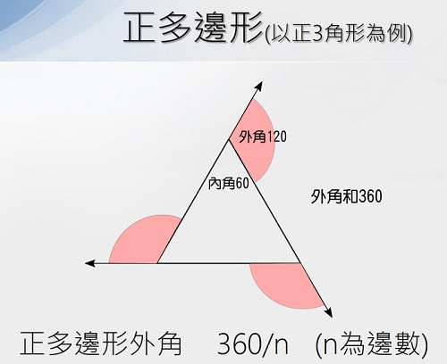

# 🔰 海龜範例 - 畫出正多邊形

--------------

### 🎦 範例影片

<div style="padding:56.25% 0 0 0;position:relative;"><iframe src="https://player.vimeo.com/video/584284056?badge=0&amp;autopause=0&amp;player_id=0&amp;app_id=58479" frameborder="0" allow="autoplay; fullscreen; picture-in-picture" allowfullscreen style="position:absolute;top:0;left:0;width:100%;height:100%;" title="regular_polygon.mp4"></iframe></div><script src="https://player.vimeo.com/api/player.js"></script>

--------------

### 🏷️ 原理說明
正多邊形的外角和都是360度，海龜在轉出一個角度的線條時，角度都是外角



利用這個外角的特性，我們先定義出正多邊形的函式(引數為長與邊)。

利用for迴圈重複10次，即可連續畫出3邊形到12邊形

---------------------------

### 📄 Py4t程式碼
```python
from 海龜模組 import *

def 正多邊形(長, 邊):
    for 序 in range(邊):
        向前(長)
        右轉(360 / 邊)

變數 = 3

for 序 in range(10):
    print(變數)
    正多邊形(100, 變數)
    變數 += 1
```

---------------------------

### 💻 執行截圖


