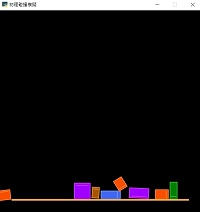
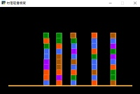
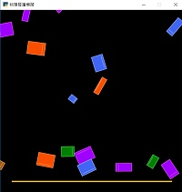

物理碰撞模擬 範例
================================

物理模組輔助功能：按住Ctrl及Alt鍵時，會顯示畫面座標，並可利用滑鼠右鍵新增、移除地形

無摩擦力
^^^^^^^^^^^^^^^^^^

   :ref:`無摩擦力`
   
射擊測試
^^^^^^^^^^^^^^^^^^

   :ref:`射擊測試`
   
操控重力
^^^^^^^^^^^^^^^^^^

   :ref:`操控重力`

   
