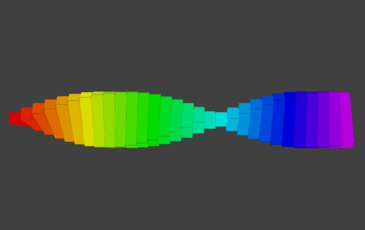

:orphan:

.. _彩色螺旋:

3D範例 彩色螺旋 
================================

利用for迴圈，沿著x軸，產生30個長方體，除了顏色的變化以外，並利用「當更新時」的事件處理函式來改變角度。

30個長方體有一個共同的上層物件(中心)，造成只要旋轉中心，就會全部一起旋轉，產生動態的彩色螺旋。

    

.. literalinclude:: color_spiral.py
    :caption: 彩色螺旋的py4t程式碼
    :linenos:

執行結果

