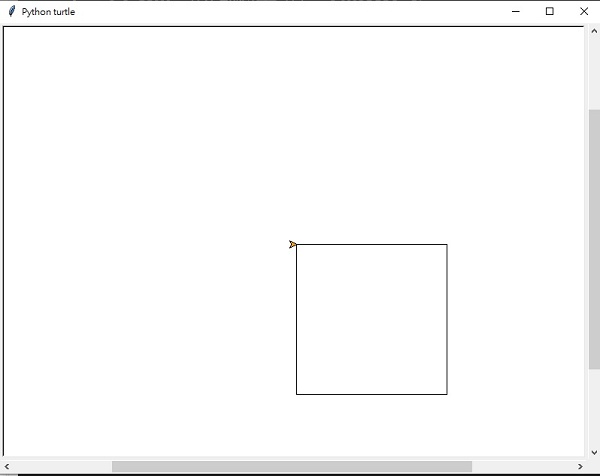

:orphan:

.. _正方形:

海龜範例 正方形 
================================

正方形有4個邊及4個角。當我們利用for迴圈重複4次，讓海龜重複前進與轉直角的動作，即可畫出正方形

.. literalinclude:: draw_square.py
    :caption: 畫出正方形的py4t程式碼
    :linenos:

執行結果

