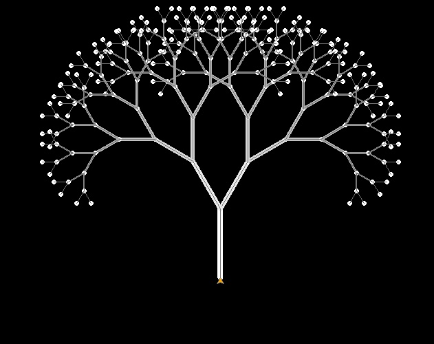

:orphan:

.. _一顆開花的樹:

海龜範例 碎形樹 
================================

碎形的每個部分都是整體縮小後的形狀。碎形在數學中是一種抽象的物體，用於描述自然界中存在的事物。

這個程式先定義一個遞迴函式「樹枝」，此函式需有一個終止條件(層為0)，主要做的事是向右分枝、向左分枝及後退。遞迴函式會不斷的呼叫自己(引數需一直改變)，在這個例子中，利用遞迴不斷的畫出分枝的樹枝。

定義了完整的「樹枝」函式，只需要執行一次，就會以遞迴的形式畫出碎形樹了。

.. literalinclude:: fractal_tree.py
    :caption: 畫出碎形樹的py4t程式碼
    :linenos:

執行結果

